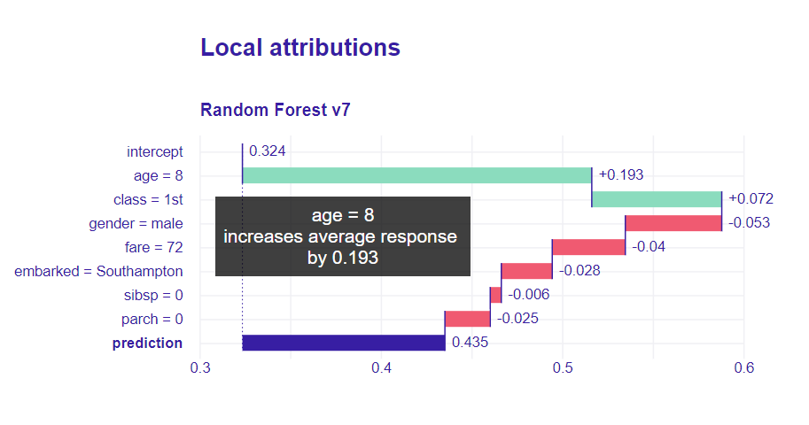

# Model Agnostic Local Attributions  

[](https://github.com/ModelOriented/iBreakDown/actions?query=workflow%3AR-CMD-check)
[](https://codecov.io/github/ModelOriented/iBreakDown?branch=master)
[](https://cran.r-project.org/package=iBreakDown)
[](http://cranlogs.r-pkg.org/badges/grand-total/iBreakDown)

## Overview

The `iBreakDown` package is a model agnostic tool for explanation of predictions from black boxes ML models.
Break Down Table shows contributions of every variable to a final prediction. 
Break Down Plot presents variable contributions in a concise graphical way. 
SHAP (Shapley Additive Attributions) values are calculated as average from random Break Down profiles.
This package works for binary classifiers as well as regression models. 

`iBreakDown` is a successor of the [breakDown](https://github.com/pbiecek/breakDown) package. It is faster (complexity O(p) instead of O(p^2)). It supports interactions and interactive explainers with D3.js plots.

It is a part of [DrWhy.AI](http://DrWhy.AI) collection of tools for XAI.

## Installation

```{r}
# the easiest way to get iBreakDown is to install it from CRAN:
install.packages("iBreakDown")

# Or the the development version from GitHub:
# install.packages("devtools")
devtools::install_github("ModelOriented/iBreakDown")
```

## Learn more

Find lots of R examples at `iBreakDown` website: https://ModelOriented.github.io/iBreakDown/

Methodology behind the **iBreakDown** package is described in the [arxiv paper](https://arxiv.org/abs/1903.11420) and [Explanatory Model Analysis](https://pbiecek.github.io/ema/breakDown.html) book.

This version also works with **D3**! 
[see an example](https://modeloriented.github.io/iBreakDown/prototypeDemo.html) and [demo](https://modeloriented.github.io/iBreakDown/articles/vignette_iBreakDown_titanic.html#plot-attributions-with-d3)


## Acknowledgments

Work on this package was financially supported by the 'NCN Opus grant 2016/21/B/ST6/02176'.
